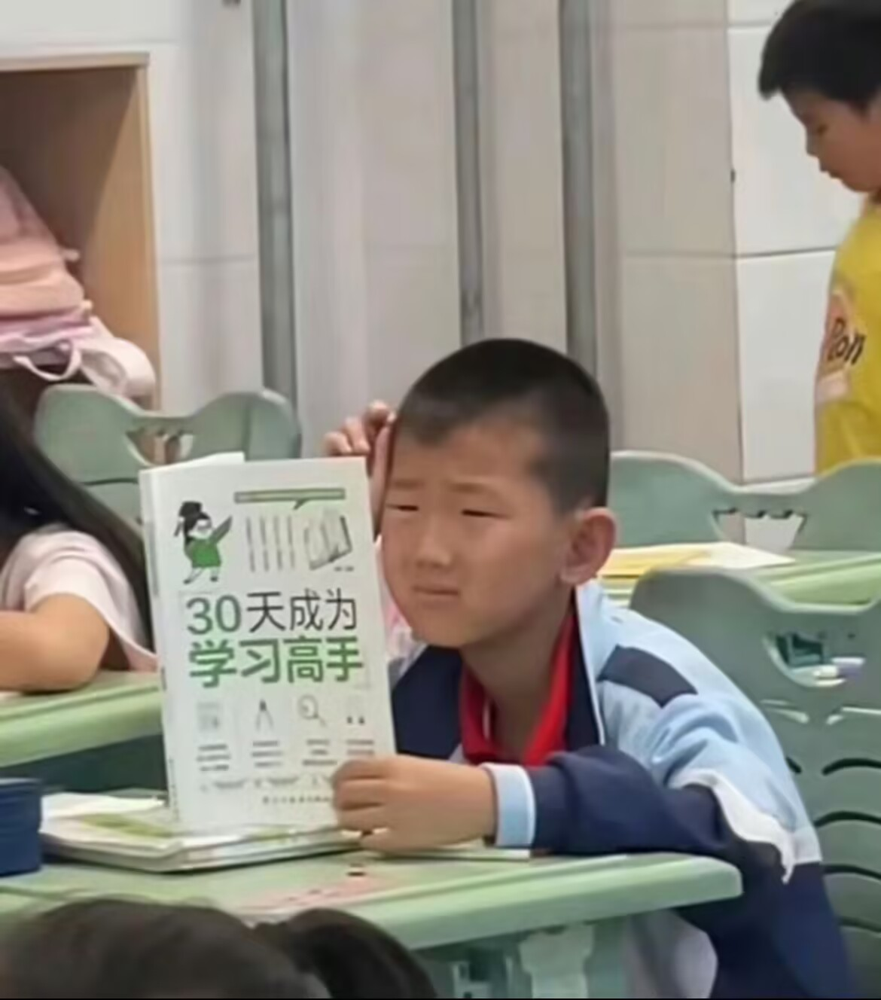
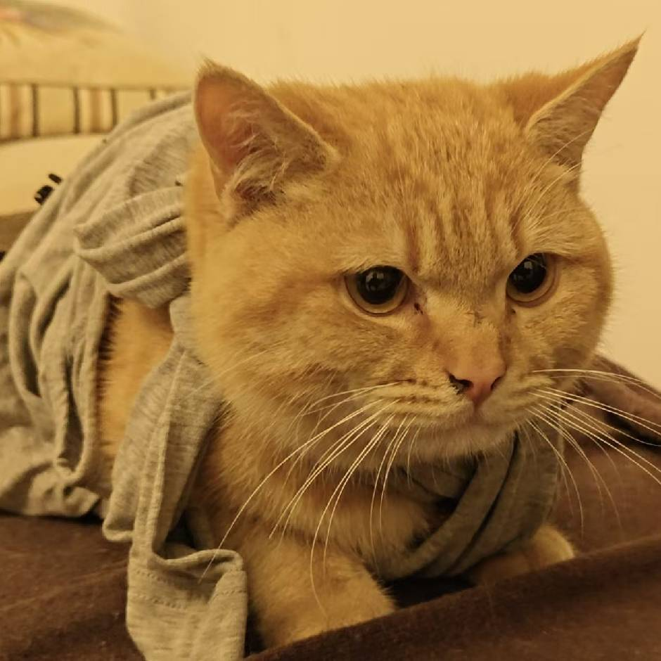

# 团队名称
软件工程第六小组

# 成员自我介绍

## 吴亚琳

#### 自我介绍：

大家好，我叫吴亚琳，来自四川成都，平时喜欢看电影、看书、看演唱会（最喜欢的歌手是华晨宇）、citywalk、享受美食~
我的mbti是INFP，比较慢热所以刚开始相处会显得比较“高冷”。总之很高兴能和大家在一个小组，一起完成软工的课程任务！

#### 技能证书：

- 四六级证书
- 软件设计师证书

#### 项目经历：

略

#### 掌握技能：

吃饭、睡觉、发呆....

## 栾曼妮

* **联系方式**：[电话号码]（13469808039）

#### 自我简介
大家好，我是栾曼妮，来自计算机学院。

#### 项目经验
略

#### 获奖经历
略

#### 掌握技能
略

## 梁旖诺 

#### 自我介绍

大家好，我叫梁旖诺，今年21岁，目前是华中师范大学计算机科学与技术专业大三学生。

#### 项目经验
略

#### 获奖经历
略

#### 掌握技能
略

## 胡淑惠

#### 自我介绍

大家好，我叫胡淑惠，来自江西，mbti是ISTJ，是计算机科学与技术的大三学生。

#### 项目经验

略

#### 获奖经历

略

#### 掌握技能

略
